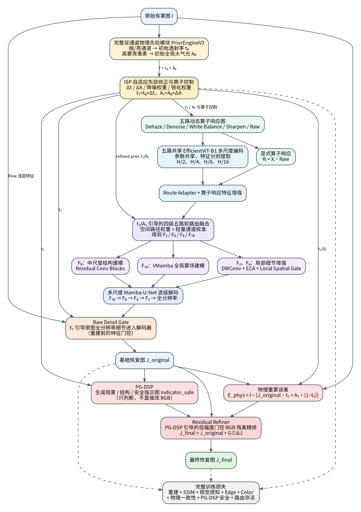

# MSDSPDD

基于互补先验、五路功能响应、动态路由、门控重建与残差精修的图像去雾实现。

[English](README.md) · [安装](docs/INSTALL.md) · [数据集](docs/DATASETS.md) ·
[权重](checkpoints/README.md) · [上传 GitHub](docs/GITHUB_UPLOAD.zh-CN.md)



## 整理内容

- 模型、先验、ISP、损失、EfficientViT 和 VMamba 源码保持原样。
- 当前使用 `finetune.py`、`evaluate.py` 和 `smoke_test.py` 三个清晰入口。
- 五个数据集的 train/val/test_reserved 清单保留原来的样本归属，路径改为可迁移形式。
- 所有原始入口及旧版本脚本放在 `legacy/original_entrypoints/`；训练历史保存在 `reports/`。
- 通用权重和五组专项权重单独作为 Release 附件，缓存与 IDE 文件不进入代码仓库。

原压缩包包含通用权重，但没有独立的通用预训练脚本。当前训练入口提供从通用权重开始的
五数据集专项微调；原始 `train_integration_example.py` 只是训练循环集成示例。

## 使用步骤

1. 按 [INSTALL.md](docs/INSTALL.md) 安装匹配的 PyTorch、EfficientViT 与 selective-scan CUDA 扩展。
2. 把权重包中的 `MSDSPDD/` 合并到代码仓库的 `MSDSPDD/`，运行权重校验。
3. 根据本机数据目录生成可用清单，然后先检查划分，再训练或测试。

```bash
python tools/verify_weights.py
python tools/check_environment.py --require-cuda --require-weights
python smoke_test.py
python tools/prepare_splits.py --data-root /你的/数据目录 --check-files
python finetune.py --dataset ihaze --check_only
python finetune.py --dataset ihaze --amp
python evaluate.py --datasets I-HAZE --protocols tile512_stride256 --save_images
```

正式运行时必须看到 `backbone fallback: False` 和 `Mamba enabled: True`。
CPU/备用主干的形状检查不等价于完整模型实验。微调输出默认保存在 `runs/finetune/`，
使用这些新权重测试时指定 `--finetune_root runs/finetune`。

默认保留旧 checkpoint；清理旧 step 目录需要显式使用 `--purge_old_step_outputs`。
其余训练参数、模型结构与计算公式均沿用原实现。

## 测试协议与完整性

原测试脚本包含六数据集、八种推理协议。固定协议示例及数据目录见
[REPRODUCIBILITY.md](docs/REPRODUCIBILITY.md) 和 [DATASETS.md](docs/DATASETS.md)。
扫描协议后挑选测试集最高分属于探索分析，正式对比应使用独立选定的固定协议。

整理过程已检查语法、清单归属、权重校验值与压缩包完整性。本机未安装 PyTorch/CUDA，
没有重新运行 GPU 训练或复现实验指标；详见 [VALIDATION.md](docs/VALIDATION.md)。

作者原代码和权重没有附带项目级许可证，整理时未替作者选择开源授权。
第三方许可证已保留在 `LICENSES/`；来源见 [THIRD_PARTY_NOTICES.md](THIRD_PARTY_NOTICES.md)。
